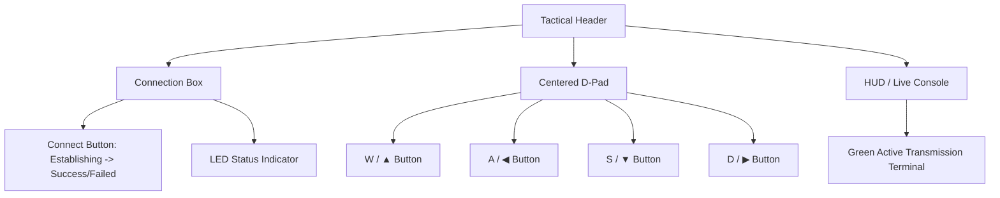

# NaviControl v2.0 Updates

A futuristic, high-tech tactical controller interface has been implemented for the robot dog.
## 🛠️ Implementation Summary

- **Mobile Responsiveness & Adaptive Icons:**
  - Implemented dynamic detection for touch-screen devices and smaller viewports (`<= 768px`).
  - On desktop/PC, the D-pad buttons display standard **WASD** labels.
  - On mobile/tablet, the keys automatically adapt to display direction arrows: **▲**, **◀**, **▼**, **▶**.

- **CSS Centralization & Styling Enhancements:**
  - Created a rich, sci-fi style sheet utilizing modern Google Fonts (`Orbitron`, `Inter`, `Share Tech Mono`), radial gradients, neon glows, glassmorphism, and active-state animations.
  - Centered the control panel and WASD/Arrow D-pad directly in the middle of the viewport.

- **Robot Connection Handshake Simulator:**
  - Added a tactical **Connect Link** button to establish a connection with the robot dog.
  - Simulates a 2-second handshaking period with a pulsing orange indicator and a loading spinner.
  - Generates realistic connection results: 85% success rate (green status) or 15% failure rate (red status, enabling a "Retry Link" option).

- **HUD Status Console:**
  - Integrated a monospaced command-line HUD at the bottom of the interface.
  - Once connected, pressing keys (WASD / Arrows on keyboard or D-pad screen buttons) activates a glowing **green terminal line** detailing the active transmissions (e.g. `● TRANSMITTING: SENDING FORWARD COMMAND` or `● TRANSMITTING: SENDING LEFT TURN MESSAGE`).
  - Provides proper safety behaviors by clearing commands when keys are released (`onpointerup`) or when the pointer drifts off a button (`onpointerleave`).

---

## 💻 Interface Layout

